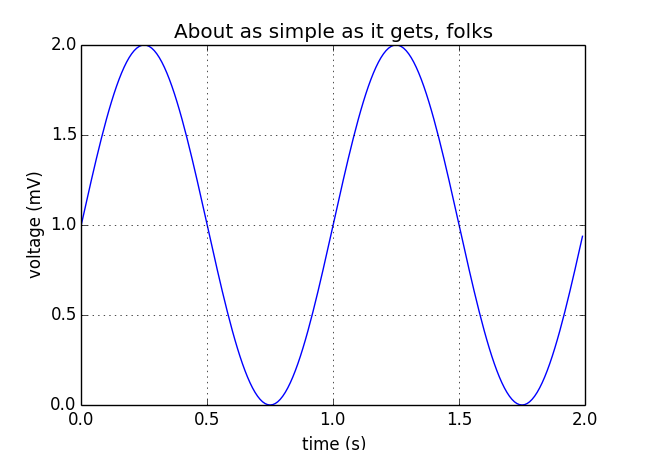

```{r setup, include=FALSE}
knitr::opts_chunk$set(echo = TRUE)
```


# Forever Monsterous
## A Kung Faux Pandas Tutorial


Kung Faux Pandas (KFP) is a set of tools which extends the [Pandas](https://pandas.pydata.org/ "Pandas Homepage") dataframe to include some tools for generating synthetic data.

There are many reasons to create synthetic data, but KFP assumes the reason is to give a statistical analyst "realistic" data, which we term _faux_ data, without exposing the real dataset.   
Details on the tools and how to install them are available on the [KFP github repository] (https://github.com/CUD2V/kungfauxpandas).

This tutorial assumes you have installed KFP as well as some standard data science tools, such as numpy, scipy, and matplotlib.

## Chapter 1:  The Problem
Monsters are a tricky lot.   They have widely varying statistics and capabilities and many have spent centuries building up their reputations in order to disuade adventurers from invading their spaces.  The smarter varieties of monsters have retained good lawyers through the ages, and it in most jurisdictions it's actually illegal to publish the "personal" data on any monster.

Of course, we would like to study the monsters without violating their privacy rights.   KFP can help this problem!

1. Generate a fake data set based on the real stuff
2. Work out all steps necessary to clean the data up
3. Code the data cleaning steps into a function
4. Re-run the data generation using the data cleaner
5. Get a clean, synthetic data set to study
6. Have a trusted agent (DM?) run your study code on the real data and deliver you the results.

# Step 0:  Get the Real Data!
In the real scenario, this step would be done in a secure computing environment to which the researcher has no access.  In order to facilitate the tutorial, we're including this step.

# Data File Available [Here](https://docs.google.com/spreadsheets/d/16ajgJpvUI0wYcSU7kjHutw8oB6Zv6eIAo5JtI6PLvu8/edit#gid=776794522)


```{python include=FALSE} 
import sqlite3
import pandas as pd
import numpy as np
import scipy as sp
import scipy.stats as stats
import pylab as plt
from collections import Counter
import datetime
import sys
sys.path.append('../')
sys.path.append('../../../plugins/DataSynthesizer/DataSynthesizer/')
sys.path.append('../../../plugins/DataSynthesizer/')
from importlib import reload
from kungfauxpandas import KungFauxPandas, TrivialPlugin, DataSynthesizerPlugin, KDEPlugin
from fractions import Fraction

monsterfile = "../../../data/D&D 5e Monster List with Ability Scores.xlsx - Monsters by Ability Score.csv"
```

```{python, include=TRUE}
df = pd.read_csv(monsterfile)
df.sample(10)
```

```{python pyplot, echo=FALSE}
pass
#fig.savefig("pyplot.png")
#plt.close(fig)
```
```{r, echo=FALSE}

```


